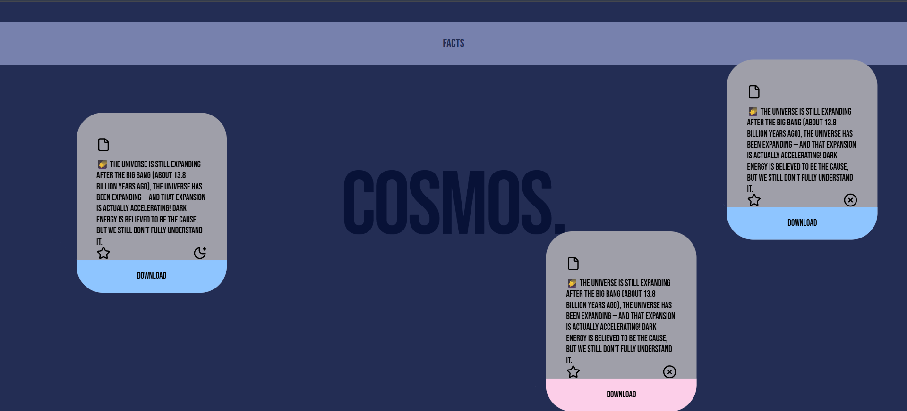

Cosmos Facts 🌠

A beautiful, interactive React application that displays fascinating facts about the cosmos with draggable cards powered by Framer Motion.

✨ Features

Interactive Draggable Cards: Drag and drop cards anywhere on the screen with smooth physics-based animations
Cosmos Facts: Learn interesting facts about the universe, space, and astronomy
Beautiful UI: Modern design with a dark theme and smooth transitions
Responsive Animations: Cards scale up while dragging for better visual feedback
Status Indicators: Each card shows whether it's open/closed with moon and cross icons
Tag System: Color-coded tags (blue/pink) for different categories

🛠️ Technologies Used

React - Frontend library
Framer Motion - Animation library for smooth drag interactions
Tailwind CSS - Utility-first CSS framework
Vite - Fast build tool and dev server
Lucide React - Beautiful icon set

📦 Installation

Clone the repository:
bashgit clone https://github.com/sameehataha/cosmos.git
cd fm-projects

Install dependencies:
bashnpm install
Run the development server:
bashnpm run dev
Open your browser and visit http://localhost:5173

🎨 Project Structure
src/
├── components/
│   ├── Background.jsx    # Background with title and header
│   ├── ForeGround.jsx    # Container for draggable cards
│   └── Card.jsx          # Individual card component
├── App.jsx               # Main application component
├── index.css             # Global styles with custom fonts
└── main.jsx              # Application entry point

🎯 How It Works

Card Component

Each card features:

Drag Constraints: Cards can only be dragged within the viewport
Scale Animation: Cards enlarge to 1.2x when being dragged
Elastic Drag: Smooth, bouncy drag behavior
Icons: File, Star, Moon/Cross icons for visual appeal
Color-coded Tags: Blue or pink tags at the bottom

Framer Motion Properties
drag - Enables dragging
dragConstraints - Limits drag area to parent container
whileDrag - Applies scale animation during drag
dragElastic - Adds elastic/bouncy feel
dragTransition - Customizes drag physics

🎨 Customization
Adding New Facts
Edit the data array in ForeGround.jsx:
javascriptconst data = [
  {
    desc: "Your cosmic fact here 🌠",
    close: false,  // true = CircleX icon, false = MoonStar icon
    tag: {
      isOpen: true, 
      tagTile: "Your Tag", 
      tagColor: "blue" // or "pink"
    },
  },
]

Changing Colors
Background: Modify bg-zinc-800 in App.jsx
Cards: Modify bg-zinc-400 in Card.jsx
Tags: Change bg-blue-300 or bg-pink-200 in Card.jsx

Adjusting Drag Physics
In Card.jsx, modify:
javascriptdragElastic={0.2}  // Elasticity (0-1)
dragTransition={{
  bounceStiffness: 600,  // Higher = less bounce
  bounceDamping: 10      // Higher = faster settling
}}

🌟 Key Features Explained

FeatureDescriptionDrag ConstraintsCards stay within viewport boundariesScale AnimationCards enlarge when grabbed for better feedbackElastic DragBouncy, physics-based drag behaviorCustom FontBebas Neue font for a modern lookIcon SystemLucide React icons for consistent design

📱 Browser Support
Chrome (recommended)
Firefox
Safari
Edge

🚀 Building for Production
bashnpm run build
The optimized files will be in the dist folder.
📄 License
This project is open source and available under the MIT License.
🤝 Contributing
Contributions, issues, and feature requests are welcome!

👨‍💻 Author
Sameeha Taha
GitHub: @sameehataha

Made with ❤️ and curiosity about the cosmos 🌌

